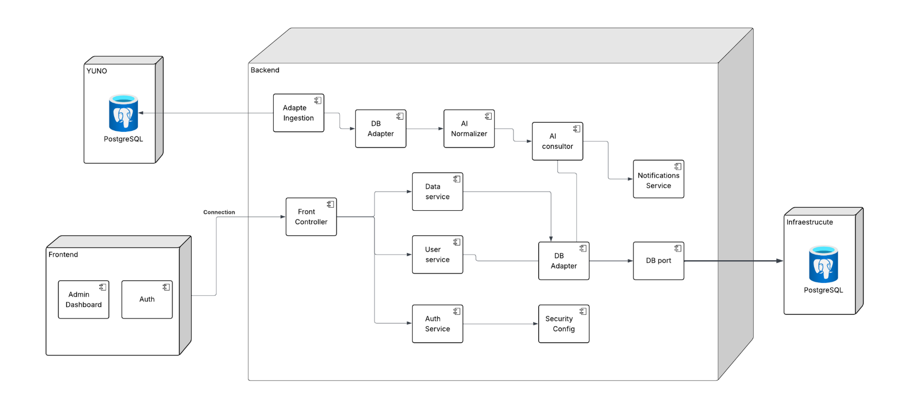

# Diagramas de Arquitectura - Payment Observability System

## 📊 Diagramas Visuales del Sistema

Esta documentación contiene diagramas ASCII y descripciones visuales para entender el sistema.

---

## Diagrama de Arquitectura

Este sistema está compuesto por un **Frontend**, un **Backend** y múltiples bases de datos PostgreSQL, estructurado para manejar datos de usuarios, normalización de información y notificaciones de manera eficiente. A continuación se describen sus componentes principales y cómo interactúan:

## Frontend
El Frontend es la interfaz del usuario y contiene los módulos:

- **Admin Dashboard**: Panel administrativo para gestión interna.
- **Auth**: Módulo de autenticación de usuarios.

El Frontend se comunica con el Backend a través del **Front Controller**, que actúa como punto de entrada central para las solicitudes de los usuarios.

## Backend
El Backend se encarga de la lógica de negocio y la gestión de datos, incluyendo:

- **Front Controller**: Recibe las solicitudes del Frontend y las redirige a los servicios correspondientes.
- **Data Service**: Maneja la lógica relacionada con la información general del sistema.
- **User Service**: Gestiona los datos y operaciones relacionadas con los usuarios.
- **Auth Service**: Gestiona autenticación y permisos, apoyándose en **Security Config** para la configuración de seguridad.
- **DB Adapter**: Adaptador para la comunicación con las bases de datos PostgreSQL.
- **AI Normalizer**: Normaliza datos utilizando técnicas de inteligencia artificial.
- **AI Consultor**: Genera recomendaciones o consultas basadas en datos normalizados.
- **Notifications Service**: Envía notificaciones a los usuarios según eventos o recomendaciones generadas por el sistema.
- **Adapter Ingestion**: Conecta y extrae información de la base de datos de **YUNO**.

## Bases de Datos
El sistema utiliza dos bases de datos PostgreSQL:

1. **YUNO**: Base de datos de origen que almacena datos crudos y se conecta al Backend mediante el **Adapter Ingestion**.
2. **Infraestructure**: Base de datos principal del sistema donde se almacenan los datos procesados y normalizados para su uso por el Backend.

## Flujo de Datos
1. Los datos crudos de **YUNO** son extraídos por **Adapter Ingestion** y enviados al **DB Adapter**.
2. Los datos pasan por el **AI Normalizer** para estandarización y luego por el **AI Consultor** para generar recomendaciones.
3. Las recomendaciones pueden generar notificaciones a través de **Notifications Service**.
4. Las solicitudes del Frontend son gestionadas por el **Front Controller**, que llama a los servicios correspondientes (**Data Service**, **User Service**, **Auth Service**) y accede a la base de datos **Infraestructure** a través del **DB Adapter**.
 gestionadas por el Front Controller, que llama a los servicios correspondientes (Data Service, User Service, Auth Service) y accede a la base de datos Infraestructure a través del DB Adapter.